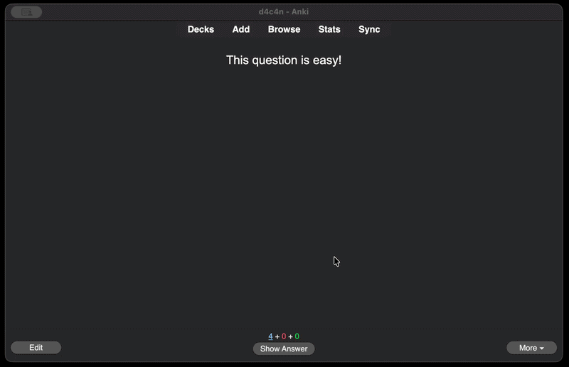

# Flash Feedback

Flashes a brief colored overlay after each Anki review answer.



## Features

- Per-answer-button color + on/off toggle (Again / Hard / Good / Easy)
- Configurable hold duration, fade-out duration, and peak opacity
- GUI config dialog — no JSON editing (Tools → Add-ons → Config)
- Non-blocking, click-through overlay; handles rapid key presses safely

## Installation

### From AnkiWeb (recommended)

Tools → Add-ons → Get Add-ons → paste code `<ANKIWEB_ID>`

### Manual

Download the `.ankiaddon` from [Releases](../../releases) and double-click it, or unzip
into your `addons21/` folder.

## Configuration

Open via **Tools → Add-ons → (select add-on) → Config**.

| Option | Type | Default | Range | Notes |
| --- | --- | --- | --- | --- |
| `enabled` | bool | `true` | — | Master on/off switch |
| `target_opacity` | float | `0.18` | 0.0 – 0.6 | Peak flash opacity. Capped at 0.6 to reduce photosensitivity risk. |
| `hold_ms` | int | `240` | 0 – 1000 | How long to hold the flash before fading (ms) |
| `fade_ms` | int | `140` | 40 – 400 | Fade-out duration (ms) |
| `eases.1.enabled` | bool | `true` | — | Flash on Again |
| `eases.1.color` | hex | `#ff3b30` | — | Color for Again |
| `eases.2.enabled` | bool | `true` | — | Flash on Hard |
| `eases.2.color` | hex | `#ff9500` | — | Color for Hard |
| `eases.3.enabled` | bool | `true` | — | Flash on Good |
| `eases.3.color` | hex | `#34c759` | — | Color for Good |
| `eases.4.enabled` | bool | `true` | — | Flash on Easy |
| `eases.4.color` | hex | `#0a84ff` | — | Color for Easy |

> **Photosensitivity note:** `target_opacity` is hard-capped at 0.6 and defaults to 0.18.
> Keep it low. Disable the add-on if you experience discomfort.

## Development setup

```bash
git clone https://github.com/d4c4n/anki-flash-feedback
cd anki-flash-feedback

# Symlink the source package into Anki's add-on folder (macOS path shown)
ln -s "$(pwd)/src/anki_flash_feedback" \
      ~/Library/Application\ Support/Anki2/addons21/anki_flash_feedback
```

Restart Anki to load the add-on. Config changes applied via the dialog take effect
immediately (no restart needed). To see stdout/stderr from the add-on, launch Anki from
a terminal:

```bash
/Applications/Anki.app/Contents/MacOS/anki
```

> **AnkiWeb version gating:** the minimum supported Anki version is set in the AnkiWeb
> upload form, not in `manifest.json`. Do not add `min_point_version` to the manifest.

## Running tests

Tests cover pure logic in `core.py` and run without Anki or Qt installed:

```bash
pip install pytest
python -m pytest
```

## Building a release

```bash
python scripts/build.py
# → dist/anki_flash_feedback.ankiaddon
```

The zip has `__init__.py` at the root (no top-level folder) and excludes `__pycache__/`,
`*.pyc`, and `meta.json` — matching AnkiWeb's packaging requirements.

## License

MIT — see [LICENSE](LICENSE).

## Contributing

Issues and pull requests welcome. Run `ruff check` and `python -m pytest` before
submitting.
